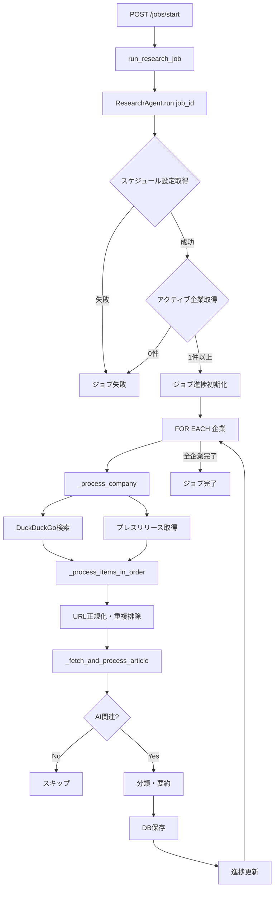

# ResearchAgent 仕様書

**最終更新**: 2025-01-05
**バージョン**: 2.0

---

## 目次

1. [概要](#概要)
2. [アーキテクチャ](#アーキテクチャ)
3. [処理フロー](#処理フロー)
4. [AI関連性判定ロジック](#AI関連性判定ロジック)
5. [データフロー](#データフロー)
6. [エラーハンドリング](#エラーハンドリング)
7. [パフォーマンス特性](#パフォーマンス特性)
8. [設定項目](#設定項目)
9. [API仕様](#API仕様)
10. [改善履歴](#改善履歴)

---

## 概要

### 目的

ResearchAgentは、金融機関のAI事例を自動収集・分析するシステムのコアコンポーネントです。複数の情報源（Web検索、プレスリリース）から記事を取得し、LLMを用いてAI関連性を判定、分類、要約を行います。

### 主要機能

1. **多源情報収集**
   - DuckDuckGo Web検索（日本語・英語クエリ）
   - 企業公式プレスリリースの自動スクレイピング

2. **AI関連性フィルタリング**
   - 2段階判定: 本文 → タイトル+スニペット（フォールバック）
   - LLM不可時は判定を保留し、記事処理を継続

3. **記事処理パイプライン**
   - PDF/HTML自動判別・抽出
   - 日付自動抽出（HTML解析 → LLM → 当日フォールバック）
   - カテゴリ分類・要約生成
   - 重複排除（URL正規化 + 既存URLチェック）

4. **ジョブ管理**
   - 非同期バックグラウンド実行
   - 進捗トラッキング（企業数・記事数）
   - エラー時の部分的継続

---

## アーキテクチャ

### システム構成

```
┌─────────────────────────────────────────────────────────────┐
│                      API Layer                               │
│  POST /jobs/start, POST /articles/from-url, etc.            │
└────────────────────┬───────────────────────────────────────┘
                     │
        ┌────────────▼────────────┐
        │   ResearchAgent         │
        │  (Orchestrator)         │
        └────────────┬────────────┘
                     │
        ┌────────────┴────────────────────────────┐
        │                                         │
        ▼                                         ▼
┌───────────────┐                       ┌────────────────┐
│ Crawler Layer │                       │  Parser Layer  │
├───────────────┤                       ├────────────────┤
│ - DuckDuckGo  │                       │ - ArticleFetch │
│ - PressScrape │                       │ - PdfExtractor │
└───────┬───────┘                       └────────┬───────┘
        │                                        │
        └────────────────┬───────────────────────┘
                         │
                ┌────────▼──────────┐
                │    LLM Layer      │
                ├───────────────────┤
                │ - Relevance       │
                │ - Classifier      │
                │ - Summarizer      │
                │ - DateExtractor   │
                └────────┬──────────┘
                         │
                ┌────────▼──────────┐
                │  Database Layer   │
                │  (CRUD + Models)  │
                └───────────────────┘
```

### 依存サービス

| サービス | 役割 | ファイル |
|---------|------|---------|
| **DuckDuckGoSearcher** | Web検索実行 | `app/services/crawler/duckduckgo_search.py` |
| **PressScraper** | プレスリリース取得 | `app/services/crawler/press_scraper.py` |
| **ArticleFetcher** | 記事コンテンツ取得（HTML/PDF） | `app/services/parser/article_fetcher.py` |
| **PdfExtractor** | PDF解析 | `app/services/parser/pdf_extractor.py` |
| **AiRelevanceClassifier** | AI関連性判定 | `app/services/llm/relevance.py` |
| **ArticleClassifier** | カテゴリ・タグ分類 | `app/services/llm/classifier.py` |
| **ArticleSummarizer** | 要約生成 | `app/services/llm/summarizer.py` |
| **DateExtractor** | 日付抽出 | `app/services/llm/date_extractor.py` |
| **OllamaClient** | LLM API通信基盤 | `app/services/llm/ollama_client.py` |
| **PromptTemplates** | プロンプト管理 | `app/services/llm/prompt_templates.py` |

---

## 処理フロー

### ジョブ実行フロー全体



### _fetch_and_process_article の詳細フロー

```
1. 記事内容取得
   ArticleFetcher.fetch_content(url)
   ├─ HTTP GET
   ├─ Content-Type判定
   ├─ PDF → PdfExtractor.extract_from_bytes()
   └─ HTML → BeautifulSoup解析

2. AI関連性判定（2段階）
   ┌─────────────────────────────────┐
   │ if article_data.content exists: │
   │   ├─ classify_article_content() │ ← 本文ベース（厳密）
   │   │   → False: return None      │
   │   │   → None:  警告のみ継続     │
   │   └─ True: 次へ                 │
   │ else:                           │
   │   ├─ classify_text()            │ ← タイトル+スニペット（軽量）
   │   │   → False: return None      │
   │   │   → None:  警告のみ継続     │
   │   └─ True: 空contentで保存      │
   └─────────────────────────────────┘

3. 日付検証
   published_date 取得優先順位:
   1. article_data.published_date
   2. item.published_date (検索結果)
   3. DateExtractor.extract_date() (LLM)
   4. datetime.now().date() (最終フォールバック)

   日付範囲チェック:
   - source="manual" → 常に保存
   - source="duckduckgo" → 常に保存
   - source="press_list" かつ date_validated=true → 再検証しない
   - その他 → start_date ≤ published_date ≤ end_date

4. LLM処理（逐次実行）
   ├─ summarizer.summarize()
   │   → summary, key_points, outcomes, technology
   │
   └─ classifier.classify()
       → category, business_area, tags, is_inappropriate

5. DB保存
   ArticleCreate → crud_article.create_article()
   content は 5000文字まで切り詰め
```

---

## AI関連性判定ロジック

### 判定戦略

ResearchAgentは **本文優先・フォールバック型** の2段階判定を採用しています。

#### 段階1: 本文ベース判定（推奨）

```python
if article_data and article_data.get("content"):
    is_ai_related = await ai_classifier.classify_article_content(
        title=article_data.get("title", title),
        content=content
    )
```

- **使用タイミング**: 記事本文の取得に成功した場合
- **精度**: 高（本文の内容を分析）
- **処理時間**: LLMの推論時間に依存
- **プロンプト**: `AI_RELEVANCE_CONTENT_PROMPT` (prompt_templates.py)
- **備考**: 判定時は本文の先頭1000文字を使用

#### 段階2: タイトル+スニペット判定（フォールバック）

```python
else:
    is_ai_related = await ai_classifier.classify_text(
        title=title,
        snippet=snippet
    )
```

- **使用タイミング**: 本文取得失敗時
- **精度**: 中（タイトルとスニペットのみ）
- **処理時間**: LLMの推論時間に依存
- **プロンプト**: `AI_RELEVANCE_TEXT_PROMPT` (prompt_templates.py)

### 判定結果の処理

| 戻り値 | 意味 | 処理 |
|--------|------|------|
| `True` | AI関連 | 処理継続（分類・要約） |
| `False` | AI関連でない | 記事を破棄（return None） |
| `None` | 判定不可（LLMエラー等） | 警告ログ出力 + 処理継続（保守的） |

### 判定基準（LLM側）

プロンプトで指定している基準:

- ✅ AI関連: 生成AI、機械学習、AI活用、AIエージェントなどの具体的言及
- ❌ 無関係: DXやデジタル化のみでAIの具体的言及がない記事、一般的なIT更新

---

## データフロー

### 検索結果のデータ構造

#### DuckDuckGo検索結果

```python
{
    "url": "https://example.com/article",
    "title": "記事タイトル",
    "snippet": "記事の概要...",
    "source": "duckduckgo"  # ResearchAgentが付与
}
```

#### プレスリリース結果

```python
{
    "url": "https://company.com/press/2025/01/news.html",
    "title": "プレスリリースタイトル",
    "snippet": "",
    "published_date": date(2025, 1, 15),
    "date_validated": True,  # 日付範囲チェック済み
    "source": "press_list"
}
```

### ArticleFetcher の返り値

```python
{
    "title": "抽出されたタイトル",
    "content": "本文テキスト（最大5000文字）",
    "url": "元のURL",
    "published_date": date(2025, 1, 15) | None
}
```

- **PDF**: `PdfExtractor` でテキスト抽出 + タイトル自動検出
- **HTML**: BeautifulSoupでセレクタベース抽出

### URL正規化ルール

`_normalize_url()` で以下を実施:

1. **追跡パラメータの削除**
   ```
   utm_source, utm_medium, gclid, fbclid, _ga など
   ```

2. **フラグメント削除**
   ```
   https://example.com/article#section1
   → https://example.com/article
   ```

3. **パスの統一**
   ```
   https://example.com/page/
   → https://example.com/page
   ```

4. **大文字小文字の統一**
   ```
   scheme と netloc を小文字化
   ```

---

## エラーハンドリング

### エラーハンドリング方針（v2.0以降）

#### 導入済みのエラーハンドリング機構

1. **ServiceError 階層**
   - `ServiceError`: 基底クラス（service_name, error_code, message, details）
   - `RetryableError`: リトライ可能なエラー
   - `NonRetryableError`: リトライ不可のエラー

2. **ErrorCode 列挙型**
   ```python
   ErrorCode.FETCH_TIMEOUT
   ErrorCode.LLM_UNAVAILABLE
   ErrorCode.PDF_EXTRACT_ERROR
   ```

3. **リトライロジック**
   - `retry_async()` + `RetryConfig` を `ArticleFetcher.fetch_content()` で使用
   - 例外種別に応じて指数バックオフで再試行

#### エラー発生時の挙動

| エラー箇所 | 挙動 | 影響範囲 |
|-----------|------|---------|
| 検索設定取得失敗 | ジョブ全体を失敗 | 全企業 |
| 企業処理エラー | 該当企業をスキップ | 1企業のみ |
| 記事取得エラー | タイトル+スニペット判定にフォールバック | 1記事のみ |
| LLM判定エラー (None) | 警告ログ + 処理継続 | 1記事のみ |
| DB保存エラー | 当該企業の処理を中断し次の企業へ | 1企業のみ |

### ログ出力

現在のログレベル:

- `[INFO]`: 正常フロー（企業処理開始、記事保存成功）
- `[WARN]`: 潜在的問題（LLM判定None、日付抽出失敗）
- `[FILTERED]`: フィルタリング（AI関連でない記事）
- `[ERROR]`: エラー（HTTP失敗、DB保存失敗）
- `[RETRY]`: リトライ実行

---

## パフォーマンス特性

### 処理時間の傾向

- LLM呼び出し（AI関連判定・分類・要約）が支配的
- 要約は本文が短い場合はスキップされる
- 要約 → 分類の順で逐次実行

### レート制限

```python
await asyncio.sleep(3)  # 企業ごと
await asyncio.sleep(1)  # 記事ごと
```

### 最適化の余地

1. **LLM呼び出しの並列化**
   - 現在: 要約・分類は逐次実行
   - 改善: `asyncio.gather()` で並列実行

2. **バッチ処理**
   - 現在: 記事ごとにDB保存
   - 改善: バッチインサート → DB負荷軽減

---

## 設定項目

### ScheduleSetting (DB)

```python
class ScheduleSetting:
    search_start_date: date    # 検索対象の開始日
    search_end_date: date      # 検索対象の終了日
    schedule_type: str         # daily / weekly
    schedule_day: int          # weekly: 0-6, daily: 1-28
    schedule_hour: int         # 0-23
```

### CompanySearchSettings (DB)

```python
class CompanySearchSettings:
    company_id: int
    region: str                # 検索リージョン（例: "jp-jp", "sg-en"）
    custom_keywords: List[str] # カスタムキーワード（ResearchAgentでは未使用）
```

### SearchConfig (app/settings/search_config.py)

```python
class SearchConfig:
    search_keywords: List[str]          # デフォルトキーワード
    default_region: Optional[str]       # デフォルトリージョン

### RegionKeywords (app/utils/region_keywords.py)

```python
def get_keywords_by_region(region: Optional[str]) -> List[str]:
    ...
```
```

---

## API仕様

### POST /jobs/start

**Request:**
```json
{
  "job_type": "manual"
}
```

**Response:**
```json
{
  "job_id": 123,
  "message": "Job started with 10 companies"
}
```

### POST /articles/from-url

手動URL追加（ResearchAgentを部分的に使用）

**Request:**
```json
{
  "company_id": 14,
  "url": "https://example.com/article"
}
```

**Response:**
```json
{
  "job_id": 230,
  "message": "URL addition job started for Sample Bank"
}
```

### POST /articles/from-urls

**Request:**
```json
{
  "company_id": 14,
  "urls": ["https://example.com/article-1", "https://example.com/article-2"]
}
```

**Response:**
```json
{
  "job_id": 231,
  "message": "2 URL(s) addition job started for Sample Bank"
}
```

---

## 改善履歴

### v2.0 (2025-01-05)

**新機能:**
- ✅ 共通ユーティリティクラス追加
  - `DateParser`: 日付解析統一
  - `JSONExtractor`: JSON抽出統一
  - `HTTPClient`: HTTPリクエスト統一
- ✅ エラーハンドリング統一
  - `ServiceError`, `RetryableError`, `NonRetryableError`
  - `ErrorCode` 列挙型
  - `retry_async()`, `@with_retry` デコレータ
- ✅ AI関連性判定の明確化
  - 本文優先・フォールバック型の2段階判定を文書化

**バグ修正:**
- 🐛 PDF抽出後のAI判定が動作しない問題を修正
- 🐛 prompt_templates.py の重複プロンプト削除

**ドキュメント:**
- 📝 本仕様書を新規作成
- 📝 処理フローの詳細図を追加
- 📝 パフォーマンス特性を明記

### v1.0 (2025-12)

**初期リリース:**
- DuckDuckGo + プレスリリース統合
- LLM分類・要約機能
- URL正規化・重複排除

---

## 付録

### 関連ファイルマップ

```
backend/
├── app/
│   ├── api/v1/
│   │   └── jobs.py                        # ジョブAPI
│   ├── services/
│   │   ├── crawler/
│   │   │   ├── research_agent.py          # ★ メインオーケストレーター
│   │   │   ├── duckduckgo_search.py       # Web検索
│   │   │   └── press_scraper.py           # プレスリリース
│   │   ├── parser/
│   │   │   ├── article_fetcher.py         # コンテンツ取得
│   │   │   └── pdf_extractor.py           # PDF解析
│   │   └── llm/
│   │       ├── ollama_client.py           # LLM基盤
│   │       ├── relevance.py               # AI判定
│   │       ├── classifier.py              # 分類
│   │       ├── summarizer.py              # 要約
│   │       ├── date_extractor.py          # 日付抽出
│   │       └── prompt_templates.py        # プロンプト管理
│   ├── utils/                              # ★ v2.0 新規追加
│   │   ├── date_parser.py                 # 日付解析統一
│   │   ├── json_extractor.py              # JSON抽出統一
│   │   ├── http_client.py                 # HTTP統一
│   │   ├── service_error.py               # エラー定義
│   │   └── retry_handler.py               # リトライ機構
│   ├── crud/
│   │   ├── company.py
│   │   ├── article.py
│   │   ├── job.py
│   │   └── schedule_setting.py
│   └── schemas/
│       └── article.py                     # ArticleCreate, ArticleUpdate
└── scripts/
    └── test_mufg_job.py                   # テストスクリプト
```

### 今後の改善予定

1. **パフォーマンス最適化**
   - [ ] LLM呼び出しの並列化（asyncio.gather）
   - [ ] DBバッチ保存
   - [ ] LLM応答のキャッシング

2. **機能追加**
   - [ ] 構造化ログシステム（JSON形式）
   - [ ] 記事の類似度判定（重複記事排除）
   - [ ] 段階的ジョブ再開機能

3. **コード品質**
   - [ ] ユニットテストカバレッジ向上
   - [ ] 型ヒントの完全化
   - [ ] Docstring の充実

---

**Document Version:** 2.0
**Last Updated:** 2025-01-05
**Maintained by:** Development Team
